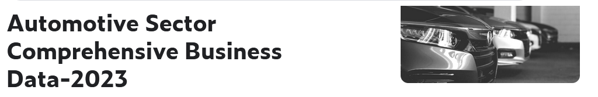

The 2023 Automotive Sector Compherensive Dataset is a comprehensive and up-to-date collection of information pertaining to the automotive sector. It encompasses a wide range of data points and metrics that shed light on the various facets of the industry, including manufacturers, vehicle models, sales figures, market trends, and more. This dataset is an invaluable resource for analysts, researchers, and businesses within the automotive domain, offering the latest insights into market performance, consumer preferences, emerging technologies, and regulatory changes. With information spanning from global automotive giants to niche market segments, the dataset is designed to support informed decision-making and strategic planning within the dynamic and ever-evolving automotive industry of 2023.

URL Dataset: https://www.kaggle.com/datasets/grncode/automotive-sector-compherensive-business-data-2023?select=customer.csv